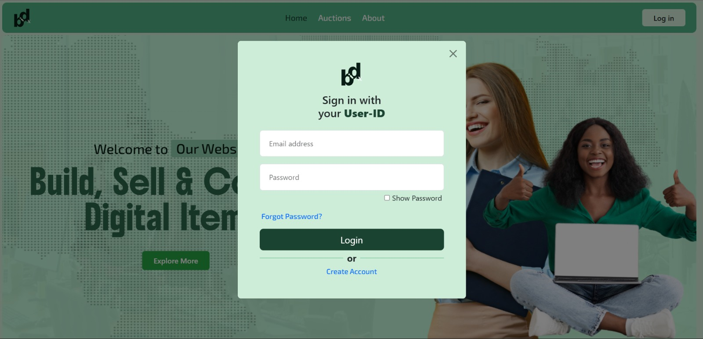
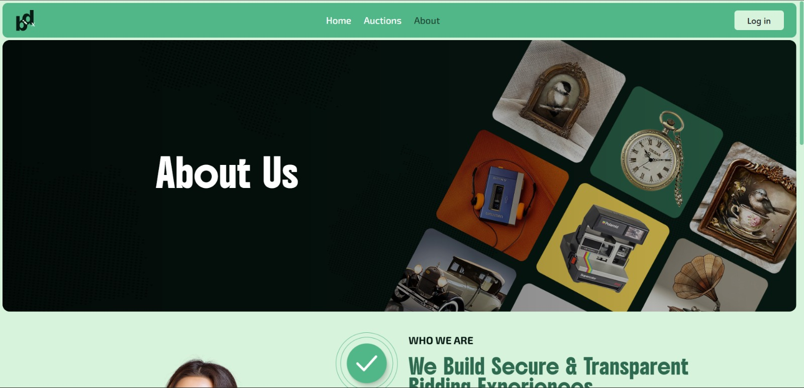

# 🏆 SecureBid - Online Bidding Platform

A modern, secure, and fully responsive online bidding platform built using React and REST APIs.

Users can create auctions, upload product images, participate in live bidding, and manage their profile. Admins can review and approve listings before they go live.

---

## 🚀 Live Preview

🔗 [Live Demo Link Here]

---

## 📸 Screenshots

### 🏠 Home Page


---

### 🔐 Authentication


---

### 📦 Register User


---

### 👤 About


---

### 🛠 About Detail


---

## ✨ Features

### 👥 User Features
- Register & Login with JWT authentication
- OTP verification flow
- Profile management
- Upload multiple product images (max 6)
- Create auction with:
  - Title
  - Description
  - Expected price
  - Duration
  - Category selection
- Live auction countdown timer
- View seller details
- Secure API communication

### 🛠 Admin Features
- View all submitted auctions
- Approve / Reject listings
- Category management
- Clean dashboard UI

---

## 🛡 Security Features

- JWT Access Token
- Refresh Token flow
- Axios Interceptors
- Protected routes
- Role-based UI rendering
- Secure API calls

---

## 🧰 Tech Stack

### Frontend
- React (Vite)
- React Router DOM
- Bootstrap 5
- Axios
- GSAP (Animations)
- React Context API

### Backend (API)
- REST APIs
- JWT Authentication
- Role-based access control

### Image Upload
- Cloudinary

---

## ▶️ How to Run This Project

### 📋 Prerequisites

Make sure the following are installed on your system:

- Node.js (v17 or higher recommended)
- npm
- Backend API running

Check your installed versions:

```bash
node -v
npm -v


